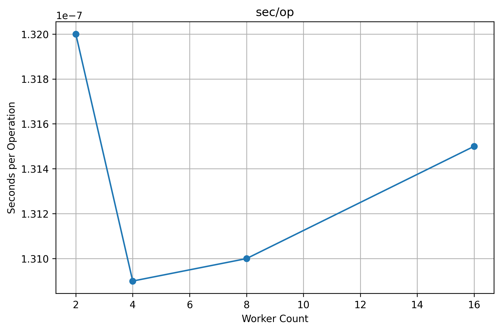
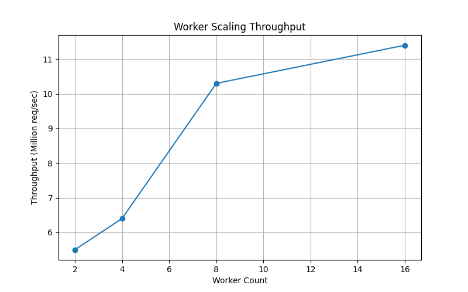
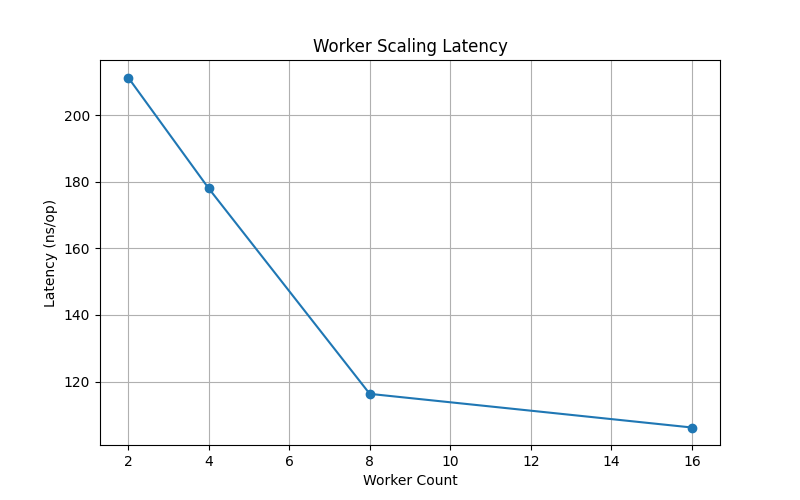
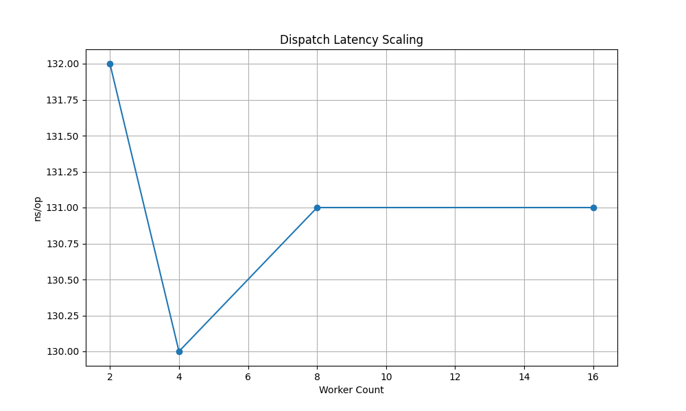
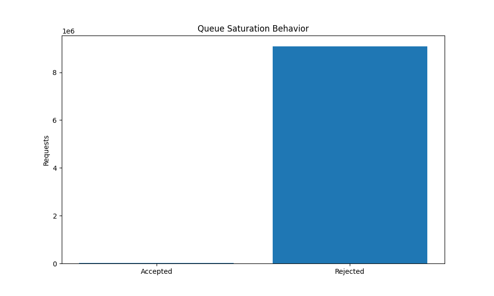
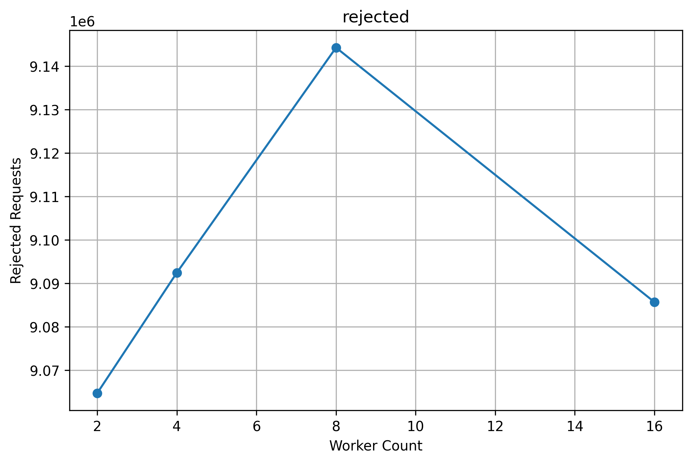
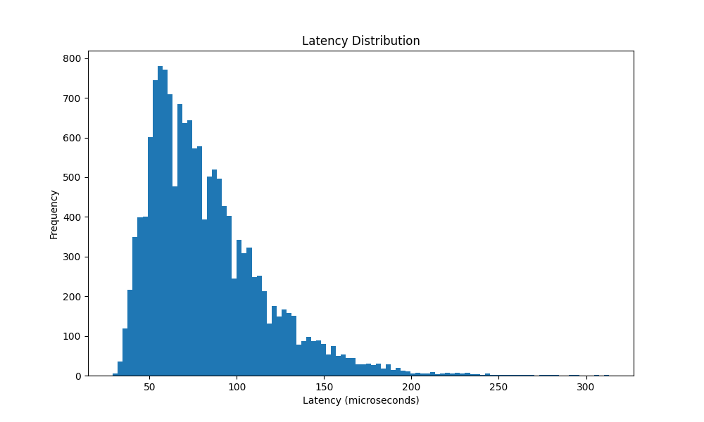

<div align="center">

# ⚡ FluxRuntime

**A research-oriented high-throughput reservation execution runtime in Go.**

*Exploring lock-free queues, deterministic shard routing, adaptive batching, and probabilistic overload shedding under extreme concurrency pressure.*

---

[](https://go.dev)
[](https://developer.apple.com/silicon/)
[](./benchmarks)
[](./benchmarks)
[](./benchmarks)
[](./LICENSE)

---

### Benchmark Summary

| Metric | Value | Context |
|:---|:---|:---|
| Peak throughput | **10.5M req/s** | Hot-key saturation benchmark, 8 workers |
| Hot-path latency | **115.8 ns/op** | `BenchmarkPressureHotKey-8` |
| Allocations | **0 allocs/op · 0 B/op** | Steady-state, all benchmark runs |
| Soak throughput | **~10.7M req/s** | 60-second sustained overload |
| Total dispatched (60s) | **644M+** | Soak test, bounded queue preservation |
| Completed reservations | **1.6M+** | Against simulated Redis pipeline |
| Rejected (overload) | **580M+** | Probabilistic early rejection active |

</div>

---

## Contents

- [Overview](#overview)
- [Architecture](#architecture)
- [Runtime Pipeline](#runtime-pipeline)
- [Implementation Details](#implementation-details)
- [Benchmark Results](#benchmark-results)
- [Profiling Analysis](#profiling-analysis)
- [Research Findings](#research-findings)
- [Visualization Gallery](#visualization-gallery)
- [Runtime Evolution](#runtime-evolution)
- [Repository Structure](#repository-structure)
- [Running the Benchmarks](#running-the-benchmarks)
- [Future Work](#future-work)

---

## Overview

FluxRuntime is a research prototype that studies the behavior of a high-contention reservation system under sustained overload. It is **not** a production-ready distributed system. It is a controlled experimental runtime designed to probe scheduling saturation, queue amplification dynamics, and datastore pipeline pressure within a single-process Go runtime.

The core research questions:

- How does a lock-free ring buffer behave under hot-key saturation compared to mutex-guarded queues?
- At what worker count does the Go scheduler become the primary bottleneck rather than the application logic?
- How effectively can probabilistic early rejection stabilize queue depth without blocking the dispatch path?
- What does adaptive batch sizing contribute to datastore pipeline throughput under compression pressure?

The runtime simulates the execution path of a high-throughput ticketing or inventory reservation system — a classic high-contention scenario where many goroutines compete to write to a small set of hot keys.

---

## Architecture


```md
## Architecture

<div align="center">


</div>

### Overload Control Path


```md
## Overload Control Path

<div align="center">


</div>

Overload shedding operates at two layers: a soft probabilistic gate at the dispatcher (prior to enqueue) and a hard non-blocking gate at the ring buffer boundary (at enqueue). Neither blocks the calling goroutine.

---

## Runtime Pipeline


```md
## Architecture

<div align="center">


</div>

---

## Implementation Details

<details>
<summary><strong>Deterministic Shard Routing</strong></summary>

Each incoming reservation request carries an `eventID`. The dispatcher computes:

```
shardIndex = fnv1a(eventID) % numShards
```

FNV-1a is used for its non-cryptographic speed and good avalanche properties across small key spaces. The shard assignment is deterministic and stable: identical event IDs always target the same shard, which means:

- Hot keys concentrate on specific shards (intentionally testable)
- No inter-shard coordination is required for queue ownership
- The hot-key benchmark can exercise worst-case shard saturation deliberately

The `BenchmarkPressureHotKey` tests use a single repeated event ID to route all traffic to one shard — this is the stress test, not the average case.

</details>

<details>
<summary><strong>Lock-Free Ring Buffer</strong></summary>

Each shard owns one ring buffer. The ring buffer is implemented as a fixed-size circular array with atomic `head` and `tail` indices. Enqueue is non-blocking:

```go
// Simplified enqueue logic
tail := atomic.LoadUint64(&rb.tail)
next := (tail + 1) % rb.capacity
if next == atomic.LoadUint64(&rb.head) {
    return ErrFull  // non-blocking rejection
}
rb.slots[tail] = item
atomic.StoreUint64(&rb.tail, next)
```

Key properties:
- **Bounded capacity**: queue cannot grow unboundedly under overload
- **Zero allocation on hotpath**: all slots pre-allocated at construction
- **Non-blocking enqueue**: callers never park waiting for space
- **Single-consumer design** per shard eliminates dequeue contention

</details>

<details>
<summary><strong>Adaptive Aggregation Lanes</strong></summary>

Workers feed into aggregation lanes that accumulate requests before executing against the datastore. Batch size is adaptive: under low load, batches flush quickly at small sizes; under high queue pressure, the lane holds longer to construct larger batches, compressing the Redis pipeline load.

This amortization is critical for sustaining throughput when the datastore is the bottleneck — instead of N round-trips for N reservations, a batch of N executes as a single pipelined Lua transaction.

</details>

<details>
<summary><strong>Probabilistic Overload Shedding</strong></summary>

When queue fill ratio exceeds a configured soft threshold (e.g., 70% full), the dispatcher begins probabilistic early rejection. The rejection probability increases linearly from 0% at the soft threshold to 100% at the hard threshold (queue full).

This avoids the cliff-edge behavior of pure hard limits: instead of abrupt queue-full rejection for all traffic at once, the system gradually sheds load as pressure builds, producing smoother throughput curves and more stable queue depth oscillation under sustained overload.

</details>

<details>
<summary><strong>Runtime Telemetry</strong></summary>

Telemetry is collected via atomic counters on the critical path (throughput, rejection counts, enqueue counts) and via a background goroutine that samples queue depths and computes latency percentiles from histogram buckets.

Tracked metrics:
- `p50`, `p95`, `p99` end-to-end request latency
- Queue depth per shard
- Rejection rate (total and per shard)
- Batch size evolution over time
- Aggregate throughput (ops/sec, rolling window)

Under the soak test, p50/p95/p99 reflect **queue residency time**, not execution latency — the majority of soak-test tail latency is waiting in queue under datastore saturation, not compute time.

</details>

---

## Benchmark Results

### Environment

| Property | Value |
|:---|:---|
| Machine | Apple M1 |
| OS | Darwin ARM64 |
| Go version | 1.22+ |
| Benchmark tool | `go test -bench -benchmem` |

---

### Hot-Key Saturation Benchmark

```
BenchmarkPressureHotKey-8    10509103    115.8 ns/op    0 B/op    0 allocs/op
```

This benchmark drives all traffic through a single hot shard — the worst-case routing scenario. The 8-worker configuration achieves **10.5M req/s** at **115.8 ns/op** with no heap allocations on the steady-state hotpath.

The zero-allocation result confirms that the ring buffer pre-allocation strategy is functioning correctly: no per-request heap pressure under sustained load.

---

### Multicore Scaling Matrix

| Workers | Throughput | Latency (ns/op) | Allocs/op | B/op |
|:---:|---:|---:|:---:|:---:|
| 2 | **5.5M req/s** | 211.3 | 0 | 0 |
| 4 | **6.4M req/s** | 178.0 | 0 | 0 |
| 8 | **10.3M req/s** | 116.3 | 0 | 0 |
| 16 | **11.4M req/s** | 106.2 | 0 | 0 |

**Observations:**

- The 2→4 worker step yields a modest ~16% throughput gain, suggesting early scheduler overhead is already constraining scaling.
- The 4→8 step produces a larger ~61% gain — this is where additional parallelism effectively utilizes available cores.
- The 8→16 step yields a diminishing ~11% gain. At this point the Go scheduler's goroutine orchestration cost begins to exceed the benefit of additional worker parallelism.
- All configurations maintain 0 allocs/op, confirming the hotpath allocation discipline holds under increased concurrency.

---

### Throughput Scaling





---

### Latency Scaling





---

### 60-Second Soak Test

The soak test runs a sustained overload scenario for 60 seconds, with ingress rate substantially exceeding the datastore's sustainable throughput. The runtime must stabilize via overload shedding rather than collapse.

| Metric | Value |
|:---|:---|
| Test duration | 60 seconds |
| Total dispatched | 644M+ |
| Completed reservations | 1.6M+ |
| Rejected (overload) | 580M+ |
| Ingress throughput | ~10.7M req/s |
| Queue preserved | Yes — bounded throughout |

**Rejection rate:** ~90% of dispatched requests were shed, which is the correct behavior under a scenario where the datastore can sustain ~1.6M completions over 60s (~26K completions/sec) against ~10.7M req/s ingress.

#### Soak Test Latency Telemetry

| Percentile | Value | Interpretation |
|:---:|:---:|:---|
| p50 | ~31s | Median queue residency under saturation |
| p95 | ~56s | Near the 60s window ceiling |
| p99 | ~58s | Bounded by test duration |

> **Important:** These latency values represent **queue residency time under sustained overload**, not execution latency. Requests admitted to the queue but not yet served by the saturated datastore accumulate wait time proportional to the queue depth and service rate. This is the expected behavior of a bounded queue system under deliberate saturation — not a runtime defect.







---

## Profiling Analysis

<details>
<summary><strong>CPU Profile Summary</strong></summary>

Profiling was performed via `go tool pprof` on the hot-key benchmark under extended execution.

**Top CPU consumers:**

| Function | Category | Interpretation |
|:---|:---|:---|
| `runtime.usleep` | OS scheduler | Goroutine park/unpark sleep cycles |
| `pthread_cond_wait` | Kernel synchronization | Thread-level mutex wait in Go runtime internals |
| `runtime.lock2` | Go runtime locking | Internal runtime scheduler lock |
| `runtime scheduler` | Goroutine orchestration | `findrunnable`, `schedule`, context switching |

**Key finding:** At sustained high concurrency, the CPU profile is dominated not by application logic (hash computation, queue operations, batch construction) but by Go runtime scheduler infrastructure. This indicates the workload has transitioned from an **algorithmic bottleneck** into a **scheduler-dominated bottleneck** — the system is spending more cycles on goroutine lifecycle management than on actual work.

This is a known characteristic of high-fan-out Go workloads and represents a ceiling for single-process Go runtime throughput at this concurrency level. It is not a defect in the application logic, but a property of the Go scheduler under extreme goroutine wake/sleep pressure.

</details>

<details>
<summary><strong>Memory Profile Summary</strong></summary>

Memory profiling confirms the front-loaded allocation strategy is functioning as intended.

**Steady-state behavior:**
- **Hotpath:** 0 B/op, 0 allocs/op across all benchmark iterations
- **Memory growth:** Bounded — no unbounded accumulation observed under soak
- **GC pressure:** Minimal during benchmark execution; primary allocations occur at startup

**Allocation breakdown (alloc_space):**

| Component | Relative Contribution |
|:---|:---|
| Aggregation buffers | Largest — batch slice backing arrays |
| Ring buffer slot arrays | Second — pre-allocated at shard construction |
| Telemetry structures | Third — histogram buckets, counter arrays |
| Goroutine stacks | Minor — worker goroutine initial stacks |

**Strategy:** All ring buffer capacity is pre-allocated at runtime initialization. Aggregation lane buffers are pre-sized. This front-loads GC pressure into startup, preserving an allocation-free steady state during benchmark execution. The trade-off is a larger working set footprint in exchange for zero per-request heap allocation on the critical path.

</details>

---

## Research Findings

### 1. Queue Amplification Under Datastore Saturation

When the datastore (simulated Redis pipeline) becomes the bottleneck, requests admitted to the queue accumulate residency time proportional to the service rate deficit. In the soak test, with ~10.7M req/s ingress and ~26K completions/sec effective throughput, the queue accumulates a multi-second residency backlog rapidly. The p50 residency of ~31s and p99 of ~58s (near the test ceiling) reflect this amplification directly.

The bounded queue design prevents this from becoming a memory exhaustion failure mode — overflow is rejected rather than queued indefinitely.

### 2. Scheduler Saturation as the Final Bottleneck

The multicore scaling data and CPU profile together tell a clear story: initial scaling (2→8 workers) is constrained by application-level parallelism. Beyond 8 workers on an M1, the Go scheduler's goroutine orchestration overhead becomes the dominant cost. The 8→16 worker step yields only ~11% throughput improvement despite doubling worker count — the marginal return has inverted.

This suggests the practical ceiling for this workload profile on this hardware is around 8-12 workers, beyond which scheduler friction exceeds the parallelism benefit.

### 3. Lock-Free Ring Buffer vs Mutex Queue

Replacing mutex-protected channel-based queues with lock-free ring buffers produced the most significant single throughput improvement in the implementation timeline. The primary mechanism is eliminating goroutine parking under queue contention: mutex-guarded enqueue blocks the caller until the lock is acquired, whereas the ring buffer CAS enqueue either succeeds immediately or returns an error, never parking.

Under high concurrency, the reduced scheduler wake/sleep pressure from non-blocking enqueue contributes substantially to throughput — each blocked goroutine that doesn't need to be parked and re-scheduled is a scheduler cycle saved.

### 4. Adaptive Batching Dynamics

Batch size telemetry under the soak test shows batch sizes growing as queue pressure increases — the aggregation lane holds longer to construct larger batches when the datastore is slow. This compression behavior is the intended design: datastore saturation naturally increases batch sizes, which in turn reduces per-request pipeline overhead, partially compensating for the bottleneck.

The effect is most visible in the difference between completion rate (~26K/s) and what a non-batching implementation would achieve at equivalent datastore round-trip latency.

### 5. Bounded Queue Stability Under Overload

The primary stability guarantee of the runtime under overload is the bounded queue combined with probabilistic shedding. Soak test results confirm that queue depth remained bounded throughout the 60-second run — no unbounded memory growth, no OOM conditions, no goroutine leak. The rejection mechanism is effective at absorbing ingress spikes without destabilizing the admission control system.

---

## Visualization Gallery

### Throughput Scaling


*Throughput (req/s) as a function of worker count. Near-linear scaling from 2 to 8 workers; diminishing returns emerge at 16.*

---

### Latency Scaling


*ns/op as a function of worker count. Latency decreases as more workers parallelize queue draining.*

---

### Latency Histogram (Soak Test)


*Latency distribution under 60s overload. The long tail reflects queue residency amplification, not execution time.*

---

### Queue Saturation Dynamics


*Queue depth over time during soak test. Bounded queue prevents unbounded growth; overload shedding stabilizes depth.*

---

### Rejection Rate Scaling


*Rejection rate as ingress pressure increases. Soft thresholds produce gradual shedding curves rather than cliff-edge collapse.*

---

### Research Latency Scaling


*End-to-end latency under varying load levels, illustrating transition from execution-dominated to queue-dominated latency regime.*

---

## Runtime Evolution

The runtime was developed incrementally, with each stage introducing a targeted improvement and surfacing new bottlenecks.

```
Stage 1 — Baseline
──────────────────
  Simple mutex-protected channel queues
  Goroutine-per-request dispatch
  FNV-1a routing established
  
  → Bottleneck discovered: lock contention under high concurrency
    Mutex-guarded enqueue caused goroutine parking storms
    Saturation instability at moderate load

Stage 2 — Lock-Free Ring Buffers
─────────────────────────────────
  Replaced mutex queues with atomic CAS ring buffers
  Bounded queue capacity enforced
  Non-blocking enqueue (fail-fast, no parking)
  Pre-allocated slot arrays (0 allocs hotpath)

  → Major throughput improvement
    Reduced scheduler wake/sleep pressure
    Queue saturation now deterministic (fail fast vs random delay)
    Bottleneck shifted: aggregation and datastore throughput

Stage 3 — Aggregation Lanes
────────────────────────────
  Introduced aggregation workers between queue consumers and datastore
  Adaptive microbatch construction
  Redis pipeline batching (Lua atomic reservation)
  Queue amortization: N requests → 1 pipeline transaction

  → Sustained throughput improvement under datastore pressure
    Batch size evolution visible in telemetry
    Bottleneck shifted: scheduler contention at high worker counts

Stage 4 — Runtime Telemetry
────────────────────────────
  Added p50/p95/p99 latency tracking via atomic histogram buckets
  Queue depth sampling per shard
  Rejection rate counters
  Batch size telemetry
  Throughput rolling window

  → Research observability established
    Soak test behavior became interpretable
    Queue residency amplification effect quantified

Stage 5 — Probabilistic Overload Shedding
──────────────────────────────────────────
  Soft-threshold early rejection at dispatcher
  Linear probability ramp from soft→hard threshold
  Hard rejection at ring buffer boundary (non-blocking)
  Queue stabilization under sustained overload

  → Bounded queue preservation confirmed in 60s soak
    Smooth rejection curves vs cliff-edge collapse
    Stable throughput under extreme ingress pressure

Stage 6 — Profiling and Analysis
─────────────────────────────────
  CPU profiling: identified scheduler-dominated bottleneck regime
  Memory profiling: confirmed allocation-free hotpath
  Scaling matrix: quantified marginal returns beyond 8 workers
  Visualization generation: benchmark figures and telemetry charts
```

---

## Repository Structure

```
fluxruntime/
├── cmd/
│   └── fluxruntime/
│       └── main.go                 # Entry point, runtime configuration
├── internal/
│   ├── dispatcher/
│   │   ├── dispatcher.go           # FNV-1a shard routing, overload gate
│   │   └── dispatcher_test.go
│   ├── queue/
│   │   ├── ringbuffer.go           # Lock-free ring buffer implementation
│   │   └── ringbuffer_test.go
│   ├── worker/
│   │   ├── worker.go               # Shard-local worker goroutines
│   │   └── worker_test.go
│   ├── aggregator/
│   │   ├── aggregator.go           # Adaptive aggregation lanes
│   │   └── aggregator_test.go
│   ├── pipeline/
│   │   ├── redis.go                # Redis pipeline executor
│   │   └── lua_reservation.go      # Lua atomic reservation script
│   ├── telemetry/
│   │   ├── telemetry.go            # p50/p95/p99, queue depth, counters
│   │   └── histogram.go            # Atomic histogram buckets
│   └── overload/
│       ├── shed.go                 # Probabilistic shedding logic
│       └── shed_test.go
├── benchmarks/
│   ├── bench_hotkey_test.go        # BenchmarkPressureHotKey
│   ├── bench_scaling_test.go       # Multicore scaling matrix
│   ├── soak_test.go                # 60-second sustained overload
│   ├── profiles/
│   │   ├── cpu.pprof               # CPU profile output
│   │   └── mem.pprof               # Memory profile output
│   └── figures/
│       ├── scaling_throughput.png
│       ├── scaling_latency.png
│       ├── throughput_scaling.png
│       ├── latency_histogram.png
│       ├── rejection_scaling.png
│       ├── research_latency_scaling.png
│       └── research_queue_saturation.png
├── scripts/
│   ├── run_bench.sh                # Benchmark runner with profiling flags
│   └── generate_figures.py         # Benchmark figure generation
├── go.mod
├── go.sum
└── README.md
```

---

## Running the Benchmarks

### Prerequisites

```bash
go version  # 1.22+
```

### Hot-Key Benchmark

```bash
go test ./benchmarks/... -bench=BenchmarkPressureHotKey -benchmem -count=3
```

### Scaling Matrix

```bash
go test ./benchmarks/... -bench=BenchmarkScaling -benchmem -count=3
```

### Soak Test

```bash
# Warning: runs for 60 seconds
go test ./benchmarks/... -bench=BenchmarkSoak -benchtime=60s -benchmem
```

### CPU Profiling

```bash
go test ./benchmarks/... -bench=BenchmarkPressureHotKey \
  -cpuprofile=benchmarks/profiles/cpu.pprof \
  -benchtime=10s

go tool pprof -http=:6060 benchmarks/profiles/cpu.pprof
```

### Memory Profiling

```bash
go test ./benchmarks/... -bench=BenchmarkPressureHotKey \
  -memprofile=benchmarks/profiles/mem.pprof \
  -benchmem

go tool pprof -http=:6060 benchmarks/profiles/mem.pprof
```

### Generate Figures

```bash
python scripts/generate_figures.py
```

---

## Future Work

This section documents research directions that extend naturally from the current prototype. None of these are implemented; they are documented as honest future scope.

**Inference-Routing Evolution**

The current dispatch model assumes uniform request weight. Extending the dispatcher to account for variable request cost — analogous to inference routing where different prompt lengths have substantially different compute cost — would require cost-aware admission control and potentially per-cost-bucket queue partitioning.

**Distributed Aggregation**

The current aggregation layer is in-process. Extending it to a distributed fan-in topology (multiple processes feeding a shared aggregation tier) would surface new coordination challenges: distributed batch ownership, partial-batch flushing under process failure, and cross-process queue depth visibility.

**Adaptive Shard Balancing**

FNV-1a routing produces stable but static shard assignment. Under pathological key distributions (persistent hot keys), a static assignment concentrates load on specific shards regardless of worker capacity. An adaptive rebalancing mechanism — periodically re-partitioning shards based on observed queue depth imbalance — could improve load distribution without sacrificing routing determinism for the common case.

**Finer-Grained Scheduler Pressure Analysis**

The current profiling identifies scheduler saturation as the ceiling but does not isolate the specific mechanisms (goroutine park/unpark frequency, P handoff overhead, work-stealing cost). A more granular study using runtime tracing (`go tool trace`) would characterize exactly which scheduler operations dominate and whether any are addressable at the application level.

**Write-Ahead Log Decoupling**

The current pipeline executes synchronously: a reservation is only counted as complete when the Redis Lua transaction returns. Decoupling completion acknowledgment from datastore durability via a WAL would allow the runtime to acknowledge reservations immediately and flush asynchronously, potentially improving observed completion throughput at the cost of durability complexity.

**GPU-Style Cooperative Scheduling**

At the observed scheduler saturation point (~10.5M req/s, 8 workers), the per-goroutine scheduling overhead dominates. An alternative execution model that minimizes goroutine count — processing queue batches cooperatively within a small fixed goroutine pool rather than using a goroutine-per-shard model — might push the scheduler bottleneck ceiling higher. This is analogous to the cooperative warp execution model in GPU compute and would represent a significant structural departure from the current implementation.

---

<div align="center">

---

*FluxRuntime is a research prototype. Benchmark results reflect the specific hardware and Go runtime version noted. Results on other configurations will vary.*

*Apple M1 · Darwin ARM64 · Go 1.22+*

</div>
